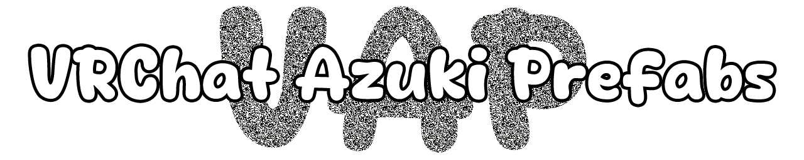

# VRChat Azuki Prefabs (VAP)

A collection of prefabs and assets designed to enhance **VRChat avatars** with advanced animations and interactive systems.

###
# Avatar Prefabs

Each avatar prefab should only be used **once per avatar**.

<h2>Frame Time Prefab</h2>

Adds a **Frame Time system** to the avatar. This prefab is required for most other prefabs.

### Instructions
1. Drag and drop the prefab into the avatar's hierarchy.

### Output Animator Parameters

| Property | Animator Type | Description |
|-|-|-|
| FrameTime | Float | Stores the calculated frame time |
| VAP/Smooth/Gesture | Float | Smoothness factor used for gesture calculations |
| VAP/Smooth/Touch | Float | Smoothness factor used for touch interactions |
| VAP/Smooth/StepSizeOne | Float | Step size increment applied every second |

---

<h2>Blink System Prefab</h2>

Adds **custom blinking** with the ability to **override the blink state** or **disable blinking entirely**.

### Instructions
1. Drag and drop the prefab into the avatar's hierarchy.
2. Use the animator parameters `VAP/Blink/Left` and `VAP/Blink/Right` to drive the blink blendshapes.
3. Optionally, create an expression parameter and toggle for `BlinkActive` to disable blinking.
4. Optionally, use the animator parameters `VAP/Override/Blink/Left` and `VAP/Override/Blink/Right` for interactions such as eye pokes.

### Included Expression Parameters

| Property | Animator Type | Expression Type | Synced | Description |
|-|-|-|-|-|
| Blink | Bool | Bool | ✔ | Synchronizes the blink state |

### Optional Expression Parameters

| Property | Animator Type | Expression Type | Synced | Description |
|-|-|-|-|-|
| BlinkActive | Bool | Bool | ✖ | Enables or disables the blinking feature |

### Output Animator Parameters

| Property | Animator Type | Description |
|-|-|-|
| VAP/Blink/Left | Float | Output value used to drive the **left eye blink** blendshape |
| VAP/Blink/Right | Float | Output value used to drive the **right eye blink** blendshape |

### Input Animator Parameters

| Property | Animator Type | Description |
|-|-|-|
| VAP/Override/Blink/Left | Float | Override value applied to `VAP/Blink/Left` when not blinking |
| VAP/Override/Blink/Right | Float | Override value applied to `VAP/Blink/Right` when not blinking |

---

<h2>Ear Twitch Prefab</h2>

Adds occasional **ear twitches** that trigger at random intervals.

### Instructions
1. Drag and drop the prefab into the avatar's hierarchy.
2. Use the animator parameters `VAP/Ear/Left_Twitch` and `VAP/Ear/Right_Twitch` to drive ear rotations.
3. Optionally, create an expression parameter and toggle for `EarTwitchActive` to disable ear twitches.

### Included Expression Parameters

| Property | Animator Type | Expression Type | Synced | Description |
|-|-|-|-|-|
| EarTwitchLeft | Bool | Bool | ✔ | Synchronizes the left ear twitch |
| EarTwitchRight | Bool | Bool | ✔ | Synchronizes the right ear twitch |

### Optional Expression Parameters

| Property | Animator Type | Expression Type | Synced | Description |
|-|-|-|-|-|
| EarTwitchActive | Bool | Bool | ✖ | Enables or disables the ear twitch feature |

### Output Animator Parameters

| Property | Animator Type | Description |
|-|-|-|
| VAP/Ear/Left_Twitch | Float | Output value used to drive the **left ear twitch** animation. This value is set to `100` to override other animations through a direct blend tree |
| VAP/Ear/Right_Twitch | Float | Output value used to drive the **right ear twitch** animation. This value is set to `100` to override other animations through a direct blend tree |

---

<h2>Logarithmic Gestures Prefab</h2>

> Requires the **Frame Time Prefab**.

Adds **blend tree–driven gesture detection** with smoothing and optional menu-based overrides. Create your gesture blend tree using the available Parameters.

### Instructions
1. Drag and drop the prefab into the avatar's hierarchy.
2. Use the animator parameters `VAP/GestureLeft/*` and `VAP/GestureRight/*` to drive gestures.
3. Optionally, use the assets `VAP Logarithmic Gestures Override Parameters`, `VAP Logarithmic Gestures Override Left Menu`, and `VAP Logarithmic Gestures Override Right Menu` to add gesture overrides to the expression menu.

### Included Expression Parameters

| Property | Animator Type | Expression Type | Synced | Description |
|-|-|-|-|-|
| QuestControllers | Float | Boolean  | ✔ | Add with VRCFury to disable victory gestures & trigger weights

### Optional Expression Parameters

| Property | Animator Type | Expression Type | Synced | Description |
|-|-|-|-|-|
| GestureLeftOverride | Float | Integer | ✔ | Overrides the left gesture using the provided expression menu |
| GestureRightOverride | Float | Integer | ✔ | Overrides the right gesture using the provided expression menu |

### Output Animator Parameters

| Property | Animator Type | Description |
|-|-|-|
| VAP/GestureLeft | Float | Output value representing the current left gesture |
| VAP/GestureRight | Float | Output value representing the current right gesture |
| VAP/GestureLeft/Weight | Float | Smoothed output value representing the left gesture weight |
| VAP/GestureRight/Weight | Float | Smoothed output value representing the right gesture weight |
| VAP/GestureLeft/Idle | Float | Smoothed output value when the left gesture is **Idle** |
| VAP/GestureLeft/Fist | Float | Smoothed output value when the left gesture is **Fist** |
| VAP/GestureLeft/Open | Float | Smoothed output value when the left gesture is **Open** |
| VAP/GestureLeft/Point | Float | Smoothed output value when the left gesture is **Point** |
| VAP/GestureLeft/Victory | Float | Smoothed output value when the left gesture is **Victory** |
| VAP/GestureLeft/Rock&Roll | Float | Smoothed output value when the left gesture is **Rock & Roll** |
| VAP/GestureLeft/Gun | Float | Smoothed output value when the left gesture is **Gun** |
| VAP/GestureLeft/ThumbsUp | Float | Smoothed output value when the left gesture is **Thumbs Up** |
| VAP/GestureRight/Fist | Float | Smoothed output value when the right gesture is **Fist** |
| VAP/GestureRight/Open | Float | Smoothed output value when the right gesture is **Open** |
| VAP/GestureRight/Point | Float | Smoothed output value when the right gesture is **Point** |
| VAP/GestureRight/Victory | Float | Smoothed output value when the right gesture is **Victory** |
| VAP/GestureRight/Rock&Roll | Float | Smoothed output value when the right gesture is **Rock & Roll** |
| VAP/GestureRight/Gun | Float | Smoothed output value when the right gesture is **Gun** |
| VAP/GestureRight/ThumbsUp | Float | Smoothed output value when the right gesture is **Thumbs Up** |

---

<h2>Viseme Tongue Movement Prefab</h2>

> Requires the **Frame Time Prefab**.

Adds **blend tree–driven tongue viseme movement**, separated from the standard viseme blendshapes so they can be disabled independently.

### Instructions
1. Drag and drop the prefab into the avatar's hierarchy.
2. Use the animator parameters `VAP/Viseme/TongueForward` and `VAP/Viseme/TongueUp` to drive the tongue viseme blendshapes.

### Output Animator Parameters

| Property | Animator Type | Description |
|-|-|-|
| VAP/Viseme/TongueForward | Float | Smoothed output value used to drive the **Tongue Forward** blendshape |
| VAP/Viseme/TongueUp | Float | Smoothed output value used to drive the **Tongue Up** blendshape |

---

<h2>Smooth Ear Grab Prefab</h2>

> Requires the **Frame Time Prefab**.

Adds **smooth ear grab interactions** for face stretching.

### Instructions
1. Drag and drop the prefab into the avatar's hierarchy.
2. Set the parameters `Ear/Left` and `Ear/Right` for the ear PhysBones.
3. Use the animator parameters `VAP/Ear/Left_Stretch` and `VAP/Ear/Right_Stretch` to drive face stretch blendshapes.

### Output Animator Parameters

| Property | Animator Type | Description |
|-|-|-|
| VAP/Ear/Left_Stretch | Float | Smoothed output value representing left ear stretch when the ear is grabbed |
| VAP/Ear/Right_Stretch | Float | Smoothed output value representing right ear stretch when the ear is grabbed |

---

<h2>Tail Wag Speed Prefab</h2>

Controls **tail wag speed** through a menu value or animator override. Wagging automatically stops when the tail is grabbed or when a pose is active. Use the parameter `Tail` for the tail PhysBone.

### Instructions
1. Drag and drop the prefab into the avatar's hierarchy.
2. Use the animator parameter `VAP/Tail/WagSpeed` as the multiplier for the tail wag animation.
3. Optionally, use the animator parameter `VAP/Override/Tail/WagSpeed` to additively increase the speed.

### Optional Expression Parameters

| Property | Animator Type | Expression Type | Synced | Description |
|-|-|-|-|-|
| TailWagSpeed | Float | Float | ✔ | Menu value used to control tail wag speed |

### Output Animator Parameters

| Property | Animator Type | Description |
|-|-|-|
| VAP/Tail/WagSpeed | Float | Output value used as the tail wag animation speed multiplier |

### Input Animator Parameters

| Property | Animator Type | Description |
|-|-|-|
| VAP/Override/Tail/WagSpeed | Float | Overrides the minimum wag speed of `VAP/Tail/WagSpeed` |

---

<h2>Eye Poke System Prefab</h2>

> Requires the **Frame Time Prefab**.

Adds **smooth eye poke interactions** using a contact sensor for each eye.

### Instructions
1. Drag and drop the prefab into the avatar's hierarchy.
2. Position the contact sensors over the avatar's eyes.
3. Use the animator parameters `VAP/Touch/EyeLeft` and `VAP/Touch/EyeRight`.

### Output Animator Parameters

| Property | Animator Type | Description |
|-|-|-|
| VAP/Touch/EyeLeft | Float | Smoothed proximity value from the left eye contact sensor |
| VAP/Touch/EyeRight | Float | Smoothed proximity value from the right eye contact sensor |
| Touch/EyeLeft | Float | Raw proximity value from the left eye contact sensor |
| Touch/EyeRight | Float | Raw proximity value from the right eye contact sensor |

---

<h2>Foot Poke System Prefab</h2>

> Requires the **Frame Time Prefab**.

Adds **smooth foot poke interactions** using a contact sensor for each foot.

### Instructions
1. Drag and drop the prefab into the avatar's hierarchy.
2. Position the contact sensors over the avatar's feet.
3. Use the animator parameters `VAP/Touch/FootLeft` and `VAP/Touch/FootRight`.

### Output Animator Parameters

| Property | Animator Type | Description |
|-|-|-|
| VAP/Touch/FootLeft | Float | Smoothed proximity value from the left foot contact sensor |
| VAP/Touch/FootRight | Float | Smoothed proximity value from the right foot contact sensor |
| Touch/FootLeft | Float | Raw proximity value from the left foot contact sensor |
| Touch/FootRight | Float | Raw proximity value from the right foot contact sensor |

---

<h2>Nose Boop System Prefab</h2>

> Requires the **Frame Time Prefab**.

Adds a **smooth nose boop interaction** using a contact sensor.

### Instructions
1. Drag and drop the prefab into the avatar's hierarchy.
2. Position the contact sensor over the avatar's nose.
3. Use the animator parameter `VAP/Touch/Nose`.
4. Optionally, use the animator parameter `VAP/Touch/NoseTimer` for an interaction.

### Output Animator Parameters

| Property | Animator Type | Description |
|-|-|-|
| VAP/Touch/Nose | Float | Smoothed proximity value from the nose contact sensor |
| VAP/Touch/NoseTimer | Float | Timer representing how long the nose contact is held |
| Touch/Nose | Float | Raw proximity value from the nose contact sensor |

---

<h2>Toe Curl System Prefab</h2>

Adds a **toe curl feature** using two contact sensors and two rotation constraints.

### Instructions
1. Drag and drop the prefab into the avatar's hierarchy.
2. Add a game object to each **foot** of your avatar without any transforms (e.g., `Curl_L` and `Curl_R`).
3. Update the `Root Transform` of the contact sensors of `Left Curl` and `Right Curl` to your corresponding `Curl_L` and `Curl_R` game objects.
4. Update the `Target Transform` of the rotation constraints of `Left Curl` and `Right Curl` to your corresponding `Curl_L` and `Curl_R` game objects.
5. Update the `Source Transform` of the rotation constraints of `Left Curl` and `Right Curl` to the corresponding **foot** of your avatar. This will prevent the contact sensors from rotating.

### Output Animator Parameters

| Property | Animator Type | Description |
|-|-|-|
| Touch/FootLCurl | Float | Raw proximity value from the left toe curl contact sensor |
| Touch/FootRCurl | Float | Raw proximity value from the right toe curl contact sensor |

---

<h2>Heartbeat System Prefab</h2>

Adds a **heartbeat sound effect and visual display**.

### Features
- Uses a synced `float (7 bits)` for both Expression Menu–controlled and OSC values.
- Uses a synced `bool (1 bit)` to toggle the heart rate counter.

### Instructions
1. Drag and drop the prefab into the avatar's hierarchy.
2. Position the **Heartbeat Sound** object at the avatar's chest.
3. A **Contact Receiver** ensures the **Audio Source** only activates when needed. This helps avoid the VRChat limit of **three active audio sources per avatar**.
4. Position the **Heartbeat Counter** object over the avatar's **left hand**. Remove the **VRCFury Armature Link** component if you want to attach the counter elsewhere.

---

<h2>GoGo Loco Simplified Prefab</h2>

Provides **customized GoGo Loco controllers and menus** with simplified menu options and additional improvements.

### Features
- Fixes the **Index controller finger tracking issue**
- Toggle for **feral movement animations**
- Simplified and improved **menu options**

### Instructions
1. Drag and drop the prefab into the avatar's hierarchy.
2. GoGo Loco version `1.8.6` must be installed in the project.

---

<h2>VRCFT</h2>

Adds face tracking to the avatar using the **Unified Expression** blendshapes. Based on: https://github.com/Adjerry91/VRCFaceTracking-Templates

### Features
- Uses `163 synced bits`.
- Optimized blend tree designed to minimize animator parameter usage.

### Instructions
1. Drag and drop the prefab into the avatar's hierarchy.
2. Adjust the avatar's rig under **Muscles & Settings** for `Eye Down-Up` and `Eye In-Out` rotations to values typically used for MMD rigs.  
Face tracking multiplies eye rotation by **1.4×**, so using MMD-style limits ensures the final eye rotation matches what MMD worlds expect.
3. Optionally, the animator parameters `VAP/FT/*` can be used to override values from a separate FX controller.

### Blendshapes (Required + Optional)

#### Eye — eyelid
| Blendshape                      | Required | Description                                                  |
|-----------------------------------|:--------:|---------------------------------------------------------------|
| EyeClosedLeft                      | ✓        | Closes the left eyelid                                        |
| EyeClosedRight                     | ✓        | Closes the right eyelid                                       |
| EyeWideLeft                        | ✓        | Left eyelid widens beyond relaxed                              |
| EyeWideRight                       | ✓        | Right eyelid widens beyond relaxed                             |
| EyeSquintLeft                      | ✓        | Squeezes the left eye socket muscles                           |
| EyeSquintRight                     | ✓        | Squeezes the right eye socket muscles                          |
| EyeAngryLeft                       | ✗        | Narrows and angles the left eye into an angry expression       |
| EyeAngryRight                      | ✗        | Narrows and angles the right eye into an angry expression      |
| EyeSadLeft                         | ✗        | Droops the left eye into a sad expression                      |
| EyeSadRight                        | ✗        | Droops the right eye into a sad expression                     |
| EyeClosedSquintCorrectiveLeft      | ✓        | Corrective for left eye closed + squinting simultaneously      |
| EyeClosedSquintCorrectiveRight     | ✓        | Corrective for right eye closed + squinting simultaneously     |

#### Eye — gaze direction
| Blendshape         | Required | Description             |
|---------------------|:--------:|----------------------------|
| EyeLookUpLeft       | ✓        | Left eye looks up          |
| EyeLookUpRight      | ✓        | Right eye looks up         |
| EyeLookDownLeft     | ✓        | Left eye looks down        |
| EyeLookDownRight    | ✓        | Right eye looks down       |
| EyeLookInLeft       | ✓        | Left eye looks in          |
| EyeLookInRight      | ✓        | Right eye looks in         |
| EyeLookOutLeft      | ✓        | Left eye looks out         |
| EyeLookOutRight     | ✓        | Right eye looks out        |

#### Eye — pupil dilation
| Blendshape     | Required | Description                       |
|-----------------|:--------:|---------------------------------------|
| EyeConstrict    | ✓        | Constricts (shrinks) both pupils      |
| EyeDilation     | ✓        | Dilates (enlarges) both pupils        |

#### Brow
| Blendshape                             | Required | Description                                                        |
|-------------------------------------------|:--------:|----------------------------------------------------------------------|
| BrowDownLeft                               | ✓        | Pulls the left eyebrow down and in                                   |
| BrowDownRight                              | ✓        | Pulls the right eyebrow down and in                                  |
| BrowInnerUpLeft                            | ✓        | Inner left eyebrow pulls up                                          |
| BrowInnerUpRight                           | ✓        | Inner right eyebrow pulls up                                         |
| BrowOuterUpLeft                            | ✓        | Inner left eyebrow pulls up                                          |
| BrowOuterUpRight                           | ✓        | Inner right eyebrow pulls up                                         |
| BrowSadLeft                                | ✗        | Raises the inner corner of the left eyebrow into a sad expression    |
| BrowSadRight                               | ✗        | Raises the inner corner of the right eyebrow into a sad expression   |
| BrowDownEyeClosedCorrectiveLeft            | ✗        | Corrective alongside a lowered left eyebrow                          |
| BrowDownEyeClosedCorrectiveRight           | ✗        | Corrective alongside a lowered right eyebrow                         |
| BrowInnerUpEyeClosedCorrectiveLeft         | ✗        | Corrective alongside a raised left eyebrow                           |
| BrowInnerEyeClosedUpCorrectiveRight        | ✗        | Corrective alongside a raised right eyebrow (note: word order differs from Left) |
| BrowOuterUpEyeClosedCorrectiveLeft         | ✗        | Corrective alongside a raised left eyebrow                           |
| BrowOuterUpEyeClosedCorrectiveRight        | ✗        | Corrective alongside a raised right eyebrow                          |

#### Cheek
| Blendshape         | Required | Description                  |
|---------------------|:--------:|----------------------------------|
| CheekPuffLeft       | ✓        | Puffs the left side cheek        |
| CheekPuffRight      | ✓        | Puffs the right side cheek       |
| CheekSquintLeft     | ✓        | Raises the left side cheek       |
| CheekSquintRight    | ✓        | Raises the right side cheek      |
| CheekSuckLeft       | ✓        | Sucks in the left side cheek     |
| CheekSuckRight      | ✓        | Sucks in the right side cheek    |

#### Jaw
| Blendshape  | Required | Description               |
|--------------|:--------:|------------------------------|
| JawOpen      | ✓        | Opens jawbone                 |
| JawForward   | ✓        | Pushes jawbone forwards       |
| JawLeft      | ✓        | Pushes jawbone left           |
| JawRight     | ✓        | Pushes jawbone right          |

#### Lip — funnel / pucker / suck
| Blendshape                          | Required | Description                                          |
|----------------------------------------|:--------:|--------------------------------------------------------|
| LipFunnel                              | ✓        | Funnels in the upper and lower lips                     |
| LipPucker                              | ✓        | Lips push outward                                       |
| LipSuckUpper                           | ✓        | Tucks in the upper lips                                 |
| LipSuckLower                           | ✓        | Tucks in the lower lips                                 |
| LipFunnelPuckerCorrective              | ✗        | Blended in when funnel and pucker are active together   |
| LipSuckUpperMouthClosedCorrective      | ✗        | Blends upper lip suck with a closed mouth               |
| LipSuckLowerMouthClosedCorrective      | ✗        | Blends lower lip suck with a closed mouth               |

#### Mouth — position
| Blendshape   | Required | Description                                |
|---------------|:--------:|-----------------------------------------------|
| MouthClosed   | ✓        | Closes mouth (in relation to `JawOpen`)        |
| MouthLeft     | ✓        | Moves mouth left                               |
| MouthRight    | ✓        | Moves mouth right                              |

#### Mouth — smile / frown
| Blendshape                       | Required | Description                                          |
|-------------------------------------|:--------:|---------------------------------------------------------|
| MouthSmileLeft                      | ✓        | Left side mouth expresses a smile                        |
| MouthSmileRight                     | ✓        | Right side mouth expresses a smile                       |
| MouthFrownLeft                      | ✓        | Left corner lip pulls down                                |
| MouthFrownRight                     | ✓        | Right corner lip pulls down                               |
| MouthSmileMouthXCorrectiveLeft      | ✗        | Blends a left smile with leftward mouth movement          |
| MouthSmileMouthXCorrectiveRight     | ✗        | Blends a right smile with rightward mouth movement        |
| MouthFrownMouthXCorrectiveLeft      | ✗        | Blends a left frown with leftward mouth movement          |
| MouthFrownMouthXCorrectiveRight     | ✗        | Blends a right frown with rightward mouth movement        |

#### Mouth — dimple / stretch
| Blendshape         | Required | Description                            |
|---------------------|:--------:|---------------------------------------------|
| MouthDimple         | ✓        | Lip corner dimples                            |
| MouthDimpleLeft     | ✓        | Left lip corner is pulled backwards           |
| MouthDimpleRight    | ✓        | Right lip corner is pushed backwards          |
| MouthStretchLeft    | ✓        | Left corner lip pulls out and down            |
| MouthStretchRight   | ✓        | Right corner lip pulls out and down           |

#### Mouth — press / tighten
| Blendshape            | Required | Description                                     |
|-------------------------|:--------:|------------------------------------------------------|
| MouthPress              | ✓        | Mouth presses together                                |
| MouthTightener          | ✓        | Mouth tightens                                        |
| MouthTightenerLeft      | ✓        | Left side lips squeeze together horizontally          |
| MouthTightenerRight     | ✓        | Right side lips squeeze together horizontally         |

#### Mouth — upper / lower raise
| Blendshape        | Required | Description                          |
|---------------------|:--------:|------------------------------------------|
| MouthUpperUpLeft    | ✓        | Upper left part of the lip pulls up       |
| MouthUpperUpRight   | ✓        | Upper right part of the lip pulls up      |
| MouthLowerDown      | ✓        | Lowers the lower lips                     |
| MouthRaiserUpper    | ✓        | Raises the upper lip area                 |
| MouthRaiserLower    | ✓        | Raises the lower lip/chin area            |

#### Mouth/Jaw correctives
| Blendshape                | Required | Description                                              |
|------------------------------|:--------:|----------------------------------------------------------------|
| MouthXJawXCorrectiveLeft      | ✗        | Blends leftward jaw movement with leftward mouth movement       |
| MouthXJawXCorrectiveRight     | ✗        | Blends rightward jaw movement with rightward mouth movement     |

#### Nose
| Blendshape     | Required | Description               |
|-----------------|:--------:|-------------------------------|
| NoseSneer       | ✓        | Entire face sneers            |

#### Tongue
| Blendshape           | Required | Description                                                |
|------------------------|:--------:|----------------------------------------------------------------|
| TongueOut               | ✓        | Tongue visibly sticks out of the mouth                          |
| TongueUp                | ✓        | Tongue points up                                                 |
| TongueDown              | ✓        | Tongue points down                                               |
| TongueLeft              | ✓        | Tongue points left                                               |
| TongueRight             | ✓        | Tongue points right                                              |
| TongueOutStep1          | ✗        | First stage of sticking the tongue out (partial)                 |
| TongueOutStep2          | ✗        | Second stage of sticking the tongue out (full)                   |
| TongueUpLeftMorph       | ✓        | Diagonal corrective: upward + leftward tongue movement           |
| TongueUpRightMorph      | ✓        | Diagonal corrective: upward + rightward tongue movement          |
| TongueDownLeftMorph     | ✓        | Diagonal corrective: downward + leftward tongue movement         |
| TongueDownRightMorph    | ✓        | Diagonal corrective: downward + rightward tongue movement        |

### Included Expression Parameters

| Property | Animator Type | Expression Type | Synced | Description |
|-|-|-|-|-|
| FT/EyeTrackingActive | Float | Boolean | ✔ | Toggle for enabling eye tracking |
| FT/LipTrackingActive | Float | Boolean | ✔ | Toggle for enabling lip tracking |
| FT/EyeDilationEnable | Float | Boolean | ✔ | Toggle for enabling eye dilation |
| FT/FacialExpressionsDisabled | Float | Boolean | ✔ | Toggle for disabling gesture based expressions |
| FT/FaceTrackingEmulation | Float | Boolean | ✔ | Toggle for enabling face tracking emulation. Uses mouth parameters to drive eye blendshapes for headsets that do not support certain eye tracking movements |
| FT/VisemesEnable | Float | Boolean | ✔ | Toggle for enabling visemes |
| FT/EyeSync | Float | Boolean | ✔ | Toggle for synchronizing both eyes when tracking drift occurs |
| FT/LocalSmoothing | Float | Float | ✖ | Slider that controls the amount of local smoothing applied to face tracking values |
| FT/RemoteModeActive | Boolean | Boolean | ✖ | Toggle for previewing your face tracking as it appears to other players over the network |

### Optional Expression Parameters

| Property | Animator Type | Expression Type | Synced | Description |
|-|-|-|-|-|
| FT/BlepGesture | Float | Boolean | ✔ | Add with VRCFury to activate tongue out with gesture right point |

### Output Animator Parameters

| Property | Animator Type | Description |
|-|-|-|
| VAP/FT/Smile | Float | Combined smile expression value derived from face tracking data. `1` represents a smile and `-1` represents a frown |
| VAP/FT/Brow | Float | Combined eyebrow expression value derived from face tracking data. `1` represents raised brows and `-1` represents lowered brows |
| VAP/FT/Angry | Float | Combined anger expression value derived from face tracking data. `1` represents a lowered brow with nose sneer |
| VAP/FT/EyeLidNeutralLeft | Float | Output value that is `1` when the left eyelid is in a neutral, open state — use it to blend in custom eye blendshapes without conflicting with face tracking |
| VAP/FT/EyeLidNeutralRight | Float | Output value that is `1` when the right eyelid is in a neutral, open state — use it to blend in custom eye blendshapes without conflicting with face tracking |

### Input Animator Parameters

| Property | Animator Type | Description |
|-|-|-|
| VAP/Override/FT/EyeLidLeft | Float | Set to `1` to override the left eye and left brow blendshapes of the face tracking output — useful for interactions such as ear pull |
| VAP/Override/FT/EyeLidRight | Float | Set to `1` to override the right eye and right brow blendshapes of the face tracking output — useful for interactions such as ear pull |

### Face Tracking Animator Parameters

| Property | Animator Type | Description |
|-|-|-|
| VAP/FT/v2/EyeLeftX | Float | Smoothed horizontal rotation value of the left eye used for eye bones and related blendshapes |
| VAP/FT/v2/EyeRightX | Float | Smoothed horizontal rotation value of the right eye used for eye bones and related blendshapes |
| VAP/FT/v2/EyeY | Float | Smoothed vertical rotation value shared by both eyes used for eye bones and related blendshapes |
| VAP/FT/v2/EyeLidLeft | Float | Smoothed eyelid value controlling the left eyelid blendshapes |
| VAP/FT/v2/EyeLidRight | Float | Smoothed eyelid value controlling the right eyelid blendshapes |
| VAP/FT/v2/EyeSquintLeft | Float | Smoothed squint value for the left eye |
| VAP/FT/v2/EyeSquintRight | Float | Smoothed squint value for the right eye |
| VAP/FT/v2/PupilDilation | Float | Smoothed value controlling pupil dilation |
| VAP/FT/v2/BrowExpressionLeft | Float | Smoothed value controlling left eyebrow expression movement |
| VAP/FT/v2/BrowExpressionRight | Float | Smoothed value controlling right eyebrow expression movement |
| VAP/FT/v2/CheekPuffSuckLeft | Float | Smoothed value controlling left cheek puff or suck movement |
| VAP/FT/v2/CheekPuffSuckRight | Float | Smoothed value controlling right cheek puff or suck movement |
| VAP/FT/v2/NoseSneer | Float | Smoothed value controlling nose sneer expressions |
| VAP/FT/v2/JawOpen | Float | Smoothed value controlling jaw open movement |
| VAP/FT/v2/MouthClosed | Float | Smoothed value representing mouth closed compression |
| VAP/FT/v2/JawForward | Float | Smoothed value controlling forward jaw movement |
| VAP/FT/v2/JawX | Float | Smoothed value controlling horizontal jaw movement |
| VAP/FT/v2/MouthUpperUpLeft | Float | Smoothed value lifting the upper left lip |
| VAP/FT/v2/MouthUpperUpRight | Float | Smoothed value lifting the upper right lip |
| VAP/FT/v2/MouthLowerDown | Float | Smoothed value lowering the bottom lip |
| VAP/FT/v2/SmileFrownLeft | Float | Smoothed value controlling the left side smile or frown |
| VAP/FT/v2/SmileFrownRight | Float | Smoothed value controlling the right side smile or frown |
| VAP/FT/v2/LipFunnel | Float | Smoothed value controlling lip funnel expressions |
| VAP/FT/v2/LipPucker | Float | Smoothed value controlling lip pucker expressions |
| VAP/FT/v2/LipSuckUpper | Float | Smoothed value controlling the upper lip suction |
| VAP/FT/v2/LipSuckLower | Float | Smoothed value controlling the lower lip suction |
| VAP/FT/v2/MouthStretchLeft | Float | Smoothed value stretching the left side of the mouth |
| VAP/FT/v2/MouthStretchRight | Float | Smoothed value stretching the right side of the mouth |
| VAP/FT/v2/MouthTightenerLeft | Float | Smoothed value tightening the left side of the mouth |
| VAP/FT/v2/MouthTightenerRight | Float | Smoothed value tightening the right side of the mouth |
| VAP/FT/v2/MouthPress | Float | Smoothed value pressing the lips together |
| VAP/FT/v2/MouthRaiserUpper | Float | Smoothed value raising the upper lip region |
| VAP/FT/v2/MouthRaiserLower | Float | Smoothed value raising the lower lip region |
| VAP/FT/v2/MouthX | Float | Smoothed horizontal movement value of the mouth |
| VAP/FT/v2/TongueOut | Float | Smoothed value controlling tongue extension |
| VAP/FT/v2/TongueX | Float | Smoothed horizontal movement value of the tongue |
| VAP/FT/v2/TongueY | Float | Smoothed vertical movement value of the tongue |

---

<h2>Pupil Focus System Prefab</h2>

> Requires the **Frame Time Prefab**.

Adds a **Face Proximity contact receiver** that drives a **VRC Rotation Constraint** on the avatar's eyes to constrict the pupils when something gets close to the face.

### Instructions
1. Drag and drop the prefab into the avatar's hierarchy.
2. Position the contact receiver in front of the avatar's face, between the eyes.
3. Use the animator parameter `VAP/Touch/PupilFocus`.

### Output Animator Parameters

| Property | Animator Type | Description |
|-|-|-|
| VAP/Touch/PupilFocus | Float | Smoothed proximity value from the face contact sensor |
| Touch/PupilFocus | Float | Raw proximity value from the face contact sensor |

---

<h2>Raycast Floor Physbone Collider Prefab</h2>

Uses a raycast component to set the floor PhysBone collider.

### Features
- Uses a synced, saved `bool` menu toggle to enable or disable the floor collider. Enabled by default.

### Instructions
1. Drag and drop the prefab into the avatar's hierarchy.
2. Add the **Floor Physbone Collider** object to the **Colliders** list of any PhysBone components that should collide with the floor.

### Included Expression Parameters

| Property | Animator Type | Expression Type | Synced | Description |
|-|-|-|-|-|
| FloorCollider | Bool | Bool | ✔ | Menu toggle used to enable or disable the floor collider |

---

<h2>Raycast Wall Physbone Collider Prefab</h2>

Uses 2 raycast components aiming outwards (left and right) to set the wall PhysBone collider in the right spot.

### Features
- Uses a synced `bool` menu toggle to enable or disable the wall collider. Disabled by default for performance.

### Instructions
1. Drag and drop the prefab into the avatar's hierarchy.
2. Add the **Wall Physbone Collider** object to the **Colliders** list of any PhysBone components that should collide with walls.

### Included Expression Parameters

| Property | Animator Type | Expression Type | Synced | Description |
|-|-|-|-|-|
| WallCollider | Bool | Bool | ✔ | Menu toggle used to enable or disable the wall collider |

###
# Asset Prefabs

<h2>Bell Sound System Prefab</h2>

> Requires the **Frame Time Prefab**.

Adds **movement-based bell sounds** to an asset for more realistic motion effects.

### Instructions
1. Drag and drop the prefab into the asset's hierarchy.
2. Attach the **Bell Sound** game object to the desired location using a **VRCFury Armature Link**. It will be attached at the root of the selected game object.
3. A **PhysBone component** is included as a sample and can be modified or replaced as needed.
4. A **Chest Collider** is included to prevent the bell from clipping into the avatar's chest. Remove it if it is not required.

